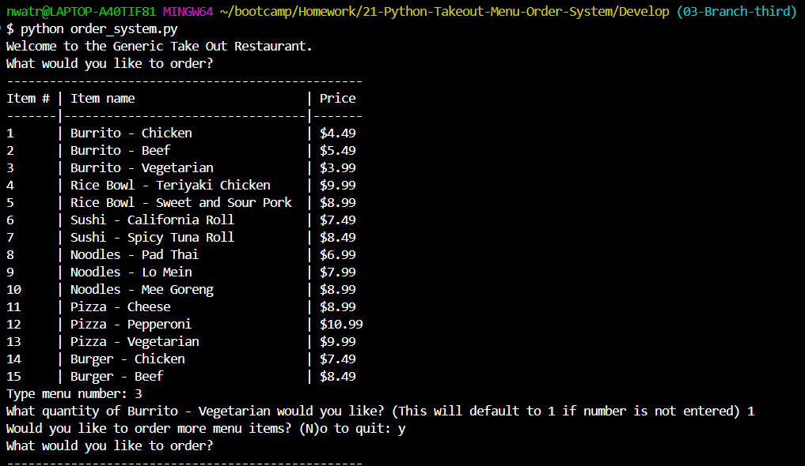
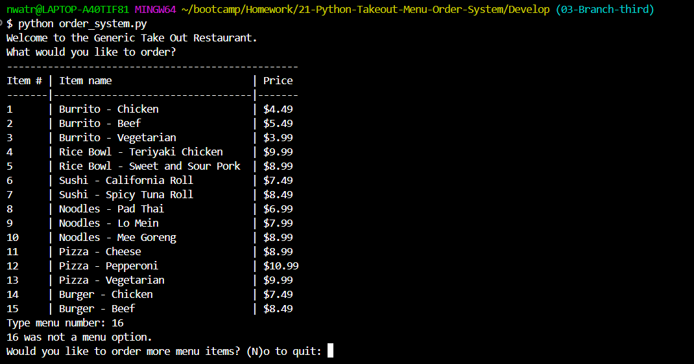
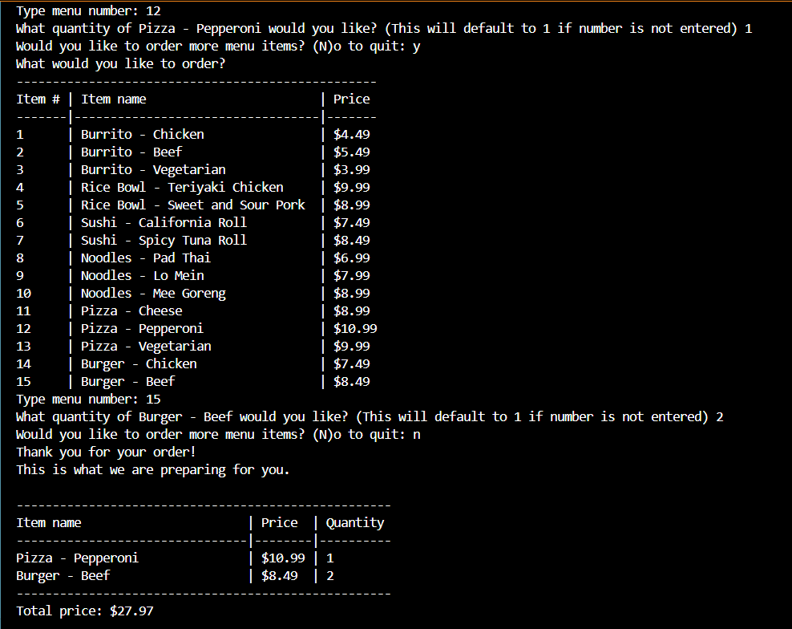

# 21 - Python Restaurant Takeout Menu Order System


## Website: 
[GitHub-Link](https://github.com/noIDEA-tech/21-Python-Takeout-Menu-Order-System)

## Description
This command-line Python application simulates a restaurant ordering system. The program allows users to view a menu, select items, specify quantities, and receive an itemized receipt with a calculated total. The application is designed with accessibility in mind, particularly for customers with hearing and vocal impairments who may prefer to interact with a digital interface rather than verbally communicating their order.





## Table of Contents

- [Usage](#usage)
- [Technical-Implementation](#technical-implementation)
- [Features](#features)
- [Tests](#tests)
- [Credits](#credits)
- [License](#license)
- [Contact](#contact)


## Usage
Run program from the command line and follow the on-screen prompts to place your order:
```m
python order_system.py
```

## Technical Implementation:
- Implemented using Python with a focus on core programming concepts:

    - Conditional statements
    - Loops
    - Functions
    - List comprehension
    - Dictionaries and nested data structures
    - Error handling with try/except blocks
    - String formatting

- No external libraries or frameworks required

## Features
- Interactive command-line interface
- Menu display with item numbers, names, and prices
- Order quantity selection for each menu item
- Input validation with appropriate error messages
- Running order tracking
- Itemized receipt generation with price calculations
- Formatted output for improved readability

## Tests
Run program from command line:  
```m
python order_system.py 
```
## Credits
Nancy Watreas

## License
MIT

## Contact: 
If there are any questions or concerns, I can be reached at:
##### [github: noIDEA-tech](https://github.com/noIDEA-tech)
##### [email: nwatreas2023@gmail.com](mailto:nwatreas2023@gmail.com)


